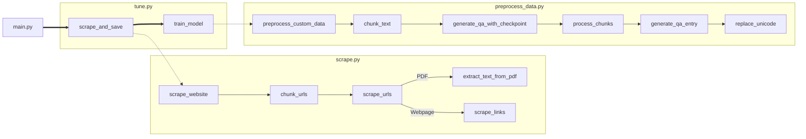

# Transformer Revamp

This repository contains a transformer that will crawl through websites, carve out the data, format the data into a JSONL file for [MLX](https://github.com/ml-explore/mlx-examples/blob/main/llms/mlx_lm/LORA.md#data), then train into a base model of your choice to create your own custom model! Please use the custom training to adjust behavioral patterns, speech patterns and add non-volitile knowledge. It is highly recommended to use RAG for volitile knowledge/information that updates frequently.

The purpose of this is to create a custom, specalized model that can be accessed through [open-webui](https://github.com/open-webui/open-webui).

The flow of the script has been greatly simplified:

