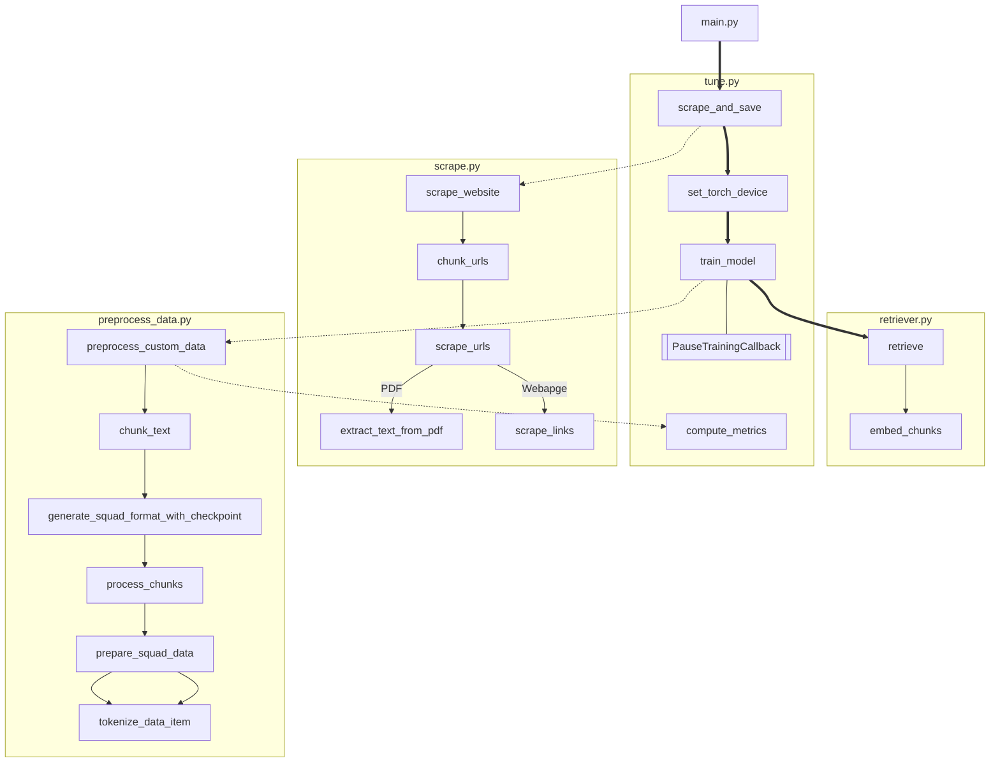

# transformers

This repository contains a transformer that will crawl through websites, carve out the data, format the data into SQuAD format, then train into a Large T5 Q&A model to answer specialized questions.

The purpose of this is to create a custom, specalized model that will be saved and accessed later using a Golang script that allows for easy terminal integration.

The flow of the script is as follows:

